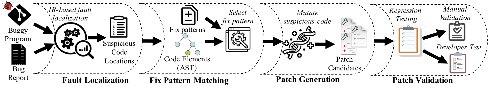

# IFixR

* [I. Introduction of IFixR](#user-content-i-introduction)
* [II. Environment setup](#user-content-ii-environment)
* [III. Run Step-by-Step](#user-content-iii-how-to-run)
* [IV. Evaluation Result](#user-content-iv-evaluation-result)
* [V. Generated Patches](#user-content-v-generated-patches)
* [VI. Structure of the project](#user-content-vi-structure-of-the-project)

## I. Introduction

*IFixR* a patch generation system for user-reported bugs




## II. Environment

#### Manual installation
* OS: macOS Mojave (10.14.3)
* JDK7: Oracle jdk1.7 (**important!**)
* JDK8: Oracle jdk1.8 (**important!**)
* Defects4J: Clone and configure [defects4j](https://github.com/rjust/defects4j) from its original repository
  ```powershell
  git clone https://github.com/rjust/defects4j
  cd defects4j
  ./init.sh

  export PATH=$PATH:"path2defects4j"/framework/bin
  
  Please add defects4j also to path since compileProjects.sh,createProjects.sh,testProjects.sh uses defects4j
  ```
* Download and configure Anaconda
* Create an python environment using the [environment file](environment.yml)
  ```powershell
  conda env create -f environment.yml
  ```

#### Before running

* Update [config file](config.yml) with corresponding user paths.
  ```powershell
  Defects4J home path requires '/' at the end
  Example: /Users/projects/defects4j/
  ```

#### Docker

* Clone the repository

* Pull image from docker hub
  ```powershell
  docker pull anilkoyuncu/ifixr
  ```

* Run the docker image sharing the repository folder
  ```powershell
  docker run -v /Users/anil.koyuncu/projects/BugReportDrivenProgramRepair/:/data -it anilkoyuncu/ifixr:latest /bin/bash
  ```

* Change folder to /data

* Follow Step III to run

## III. How to run

* Launch [startPy](startPy.sh) as follows:

  ```powershell
  bash startPy.sh [OPTIONS]
  ```

#### Running Options 

*IFixR* needs **three** input options for running.

  ```powershell
  Usage: bash startPy.sh $1 $2 $3
  where $1 is root
        $2 is job
        $3 is subject
  ```

* `root ` : The full path of directory where startPy.sh is located

* `subject` : the project name of buggy program of benchmark. (`MATH,LANG` are expected values but can be specific for job)

* `job` : the name of the job in the pipeline , supports multiple steps which needs to executed in order:

    `1.clone` : Clone target project repository.
    
    ```powershell   
      Example: bash startPy.sh /home/user/mimic clone MATH
      Example: bash startPy.sh /home/user/mimic clone LANG
    ```

    `2.collect` : Collect all commit from repository.
    
    ```powershell   
      Example: bash startPy.sh /home/user/mimic collect MATH
      Example: bash startPy.sh /home/user/mimic collect LANG
    ```

    `3.fix` : Collect commits linked to a bug report.
        
    ```powershell   
      Example: bash startPy.sh /home/user/mimic fix MATH
      Example: bash startPy.sh /home/user/mimic fix LANG
    ```


    `4.bugPoints` : Identify the snapshot of the repository before the bug fixing commit introduced.
    
        
    ```powershell   
      Example: bash startPy.sh /home/user/mimic bugPoints MATH
      Example: bash startPy.sh /home/user/mimic bugPoints LANG
    ```


    `5.brDownload` : Download bug reports recovered from commit log
    
        
    ```powershell   
      Example: bash startPy.sh /home/user/mimic brDownload MATH
      Example: bash startPy.sh /home/user/mimic brDownload LANG
    ```


    `6.brParser` : Parse bug reports to select the bug report where type labeled as BUG and status as RESOLVED or CLOSED
    
    ```powershell   
      Example: bash startPy.sh /home/user/mimic brParser MATH
      Example: bash startPy.sh /home/user/mimic brParser LANG
    ```

    `7.brFeatures` : Extract bug report features
    
    ```powershell   
      Example: bash startPy.sh /home/user/mimic brFeatures MATH
      Example: bash startPy.sh /home/user/mimic brFeatures LANG
    ```


    `8.verify` : Extract source code features
    
        
    ```powershell   
      Example: bash startPy.sh /home/user/mimic verify MATH
      Example: bash startPy.sh /home/user/mimic verify LANG
    ```


    `9.simi` :  Compute the similarity between bug reports and source code features
    
        
    ```powershell   
      Example: bash startPy.sh /home/user/mimic simi MATH
      Example: bash startPy.sh /home/user/mimic simi LANG
    ```


    `10.features` :  Compute the features from similarity scores
    
        
    ```powershell   
      Example: bash startPy.sh /home/user/mimic features MATH
      Example: bash startPy.sh /home/user/mimic features LANG
    ```


    `11.predict` :  Predict file level bug localization
    
        
    ```powershell   
      Example: bash startPy.sh /home/user/mimic predict ALL
    ```


    `12.eval` :  Retrieve predictions for all bug reports and suspiciousness scores of files.
    
        
    ```powershell   
      Example: bash startPy.sh /home/user/mimic eval ALL
    ```


    `13.stmt` :  Compute statement level bug localization
    
        
    ```powershell   
      Example: bash startPy.sh /home/user/mimic stmt ALL (!!! Clones all defects4j bugs and compile, may take significant amount of time)
    ```


    `14.gv` :  Execute generate-validation step to produce patch candidates.   
    
        
    ```powershell  
      Execute generate-validation step on a single defects4j bug (eg Lang_15, Math_34 case sensitive)
      
        Example: bash startPy.sh /home/user/mimic gv Math_34
      
      Execute generate-validation step on all dataset. (!!! Takes significant amount of time !!!)
      
        Example: bash startPy.sh /home/user/mimic gv ALL
    ```


#### Data Viewer

The data provided with replication package is listed in directory [data](data)
The data is stored in different formats. (e.g. pickle, db, csv, etc..)

The see content of the .pickle file the following script could be used.

  ```python
   import pickle as p
   import gzip
   def load_zipped_pickle(filename):
      with gzip.open(filename, 'rb') as f:
          loaded_object = p.load(f)
          return loaded_object
  ```
Usage

  ```python
  result = load_zipped_pickle('code/LANGbugReportsComplete.pickle')
  # Result is pandas object which can be exported to several formats
  # Details on how to export is listed in offical library documentation
  # https://pandas.pydata.org/pandas-docs/stable/reference/api/pandas.DataFrame.html

  ```


## IV. Evaluation Result

<!--  -->
APR tool | Lang | Math | Total
-------- | ---- | ---- | -----
jGenProg  | 0/0 | 5/18 | 5/18  
jKali  | 0/0 | 1/14 | 1/14  
jMutRepair  | 0/1 | 2/11 | 2/12  
HDRepair  | 2/6 | 4/7 | 6/13  
Nopol  | 3/7 | 1/21 | 4/28  
ACS  | 3/4 | 12/16| 15/20  
ELIXIR  | 8/12| 12/19| 20/31  
JAID  | 1/8 | 1/8 | 2/16  
ssFix  | 5/12| 10/26| 15/38  
CapGen  | 5/5 | 12/16| 17/21  
SketchFix  | 3/4 | 7/8 | 10/12  
FixMiner  | 2/3 | 12/14| 14/17  
LSRepair  | 8/14| 7/14 | 15/28  
SimFix  | 9/13| **14/26**| **23**/39  
kPAR  | 1/8 | 7/18 | 8/26  
AVATAR  | 5/11| 6/13 | 11/24  
MIMIC_opt | **11/19** | 10/25 | 21/**44**
MIMIC_all | 6/11 | 7/16 | 13/27  
MIMIC_top5 | 3/7 | 5/6 | 8/13  

## V. Generated Patches

*MIMIC* generates genuine/ plausible patches for 21/44 Defects4J bugs with its IR-based bug localizer. 


Patches | Genuineness
--------|---------
[Lang_6  ](https://github.com/fse19/mimic/blob/master/OUTPUT/MIMIC/FixedBugs/Lang_6/)  |Correct 
[Lang_7  ](https://github.com/fse19/mimic/blob/master/OUTPUT/MIMIC/FixedBugs/Lang_7/)  |Correct 
[Lang_10 ](https://github.com/fse19/mimic/blob/master/OUTPUT/MIMIC/FixedBugs/Lang_10/) |Correct 
[Lang_13 ](https://github.com/fse19/mimic/blob/master/OUTPUT/MIMIC/FixedBugs/Lang_13/) |Plausible 
[Lang_18 ](https://github.com/fse19/mimic/blob/master/OUTPUT/MIMIC/FixedBugs/Lang_18/) |Plausible 
[Lang_21 ](https://github.com/fse19/mimic/blob/master/OUTPUT/MIMIC/FixedBugs/Lang_21/) |Plausible 
[Lang_22 ](https://github.com/fse19/mimic/blob/master/OUTPUT/MIMIC/FixedBugs/Lang_22/) |Correct 
[Lang_24 ](https://github.com/fse19/mimic/blob/master/OUTPUT/MIMIC/FixedBugs/Lang_24/) |Correct 
[Lang_26 ](https://github.com/fse19/mimic/blob/master/OUTPUT/MIMIC/FixedBugs/Lang_26/) |Correct 
[Lang_33 ](https://github.com/fse19/mimic/blob/master/OUTPUT/MIMIC/FixedBugs/Lang_33/) |Correct 
[Lang_39 ](https://github.com/fse19/mimic/blob/master/OUTPUT/MIMIC/FixedBugs/Lang_39/) |Correct 
[Lang_43 ](https://github.com/fse19/mimic/blob/master/OUTPUT/MIMIC/FixedBugs/Lang_43/) |Plausible 
[Lang_44 ](https://github.com/fse19/mimic/blob/master/OUTPUT/MIMIC/FixedBugs/Lang_44/) |Plausible 
[Lang_45 ](https://github.com/fse19/mimic/blob/master/OUTPUT/MIMIC/FixedBugs/Lang_45/) |Plausible 
[Lang_47 ](https://github.com/fse19/mimic/blob/master/OUTPUT/MIMIC/FixedBugs/Lang_47/) |Correct 
[Lang_57 ](https://github.com/fse19/mimic/blob/master/OUTPUT/MIMIC/FixedBugs/Lang_57/) |Correct 
[Lang_58 ](https://github.com/fse19/mimic/blob/master/OUTPUT/MIMIC/FixedBugs/Lang_58/) |Plausible 
[Lang_59 ](https://github.com/fse19/mimic/blob/master/OUTPUT/MIMIC/FixedBugs/Lang_59/) |Correct 
[Lang_63 ](https://github.com/fse19/mimic/blob/master/OUTPUT/MIMIC/FixedBugs/Lang_63/) |Plausible 
[Math_2  ](https://github.com/fse19/mimic/blob/master/OUTPUT/MIMIC/FixedBugs/Math_2/)  |Plausible 
[Math_5  ](https://github.com/fse19/mimic/blob/master/OUTPUT/MIMIC/FixedBugs/Math_5/)  |Correct 
[Math_8  ](https://github.com/fse19/mimic/blob/master/OUTPUT/MIMIC/FixedBugs/Math_8/)  |Plausible 
[Math_11 ](https://github.com/fse19/mimic/blob/master/OUTPUT/MIMIC/FixedBugs/Math_11/) |Correct 
[Math_15 ](https://github.com/fse19/mimic/blob/master/OUTPUT/MIMIC/FixedBugs/Math_15/) |Correct 
[Math_20 ](https://github.com/fse19/mimic/blob/master/OUTPUT/MIMIC/FixedBugs/Math_20/) |Plausible 
[Math_28 ](https://github.com/fse19/mimic/blob/master/OUTPUT/MIMIC/FixedBugs/Math_28/) |Plausible 
[Math_32 ](https://github.com/fse19/mimic/blob/master/OUTPUT/MIMIC/FixedBugs/Math_32/) |Plausible 
[Math_34 ](https://github.com/fse19/mimic/blob/master/OUTPUT/MIMIC/FixedBugs/Math_34/) |Correct 
[Math_35 ](https://github.com/fse19/mimic/blob/master/OUTPUT/MIMIC/FixedBugs/Math_35/) |Correct 
[Math_42 ](https://github.com/fse19/mimic/blob/master/OUTPUT/MIMIC/FixedBugs/Math_42/) |Plausible 
[Math_52 ](https://github.com/fse19/mimic/blob/master/OUTPUT/MIMIC/FixedBugs/Math_52/) |Plausible 
[Math_57 ](https://github.com/fse19/mimic/blob/master/OUTPUT/MIMIC/FixedBugs/Math_57/) |Correct 
[Math_58 ](https://github.com/fse19/mimic/blob/master/OUTPUT/MIMIC/FixedBugs/Math_58/) |Plausible 
[Math_59 ](https://github.com/fse19/mimic/blob/master/OUTPUT/MIMIC/FixedBugs/Math_59/) |Correct 
[Math_63 ](https://github.com/fse19/mimic/blob/master/OUTPUT/MIMIC/FixedBugs/Math_63/) |Plausible 
[Math_64 ](https://github.com/fse19/mimic/blob/master/OUTPUT/MIMIC/FixedBugs/Math_64/) |Plausible 
[Math_65 ](https://github.com/fse19/mimic/blob/master/OUTPUT/MIMIC/FixedBugs/Math_65/) |Correct 
[Math_70 ](https://github.com/fse19/mimic/blob/master/OUTPUT/MIMIC/FixedBugs/Math_70/) |Correct 
[Math_75 ](https://github.com/fse19/mimic/blob/master/OUTPUT/MIMIC/FixedBugs/Math_75/) |Correct 
[Math_82 ](https://github.com/fse19/mimic/blob/master/OUTPUT/MIMIC/FixedBugs/Math_82/) |Plausible 
[Math_95 ](https://github.com/fse19/mimic/blob/master/OUTPUT/MIMIC/FixedBugs/Math_95/) |Plausible 
[Math_96 ](https://github.com/fse19/mimic/blob/master/OUTPUT/MIMIC/FixedBugs/Math_96/) |Plausible 
[Math_97 ](https://github.com/fse19/mimic/blob/master/OUTPUT/MIMIC/FixedBugs/Math_97/) |Plausible 
[Math_104](https://github.com/fse19/mimic/blob/master/OUTPUT/MIMIC/FixedBugs/Math_104/)|Plausible 


## VI. Structure of the project
```powershell
  |--- README.md                    :  user guidance
  |--- code                         :  code
  |--- data                         :  replication data
  |--- doc                          :  document
  |--- OUTPUT/MIMIC/FixedBugs       :  generated patches

```

----
